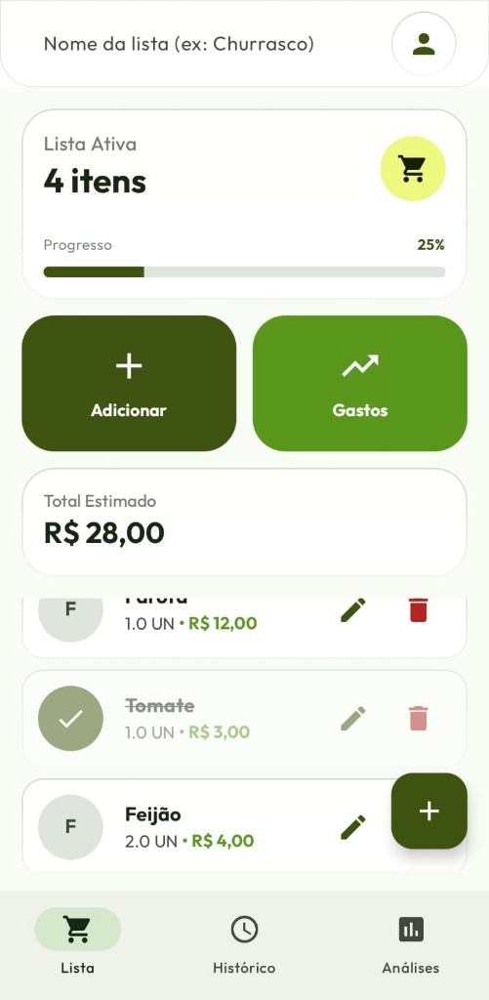

# 🛒 Mercadinho Fácil

> **Sua lista de compras inteligente, moderna e eficiente.**

O **Mercadinho Fácil** é um aplicativo Android desenvolvido para simplificar a organização das suas compras. Construído com as tecnologias mais recentes do ecossistema Jetpack, o projeto demonstra uma implementação robusta utilizando arquitetura MVVM, Clean Architecture e Firebase.

<p align="center">
  
</p>

## ✨ Funcionalidades Principais

Este aplicativo oferece uma experiência completa para o gerenciamento de compras:

*   **🔐 Autenticação Segura:** Login e registro simplificados via Firebase Authentication.
*   **📋 Listas Compartilhadas:** Crie e compartilhe listas de compras com a família ou amigos em tempo real.
*   **✅ Gerenciamento Intuitivo:** Adicione, edite e marque itens com facilidade. A interface limpa ajuda você a focar no que precisa.
*   **📊 Histórico & Analytics:** Acompanhe seus gastos e analise seu histórico de compras com gráficos interativos.
*   **🎨 UI Premium:** Design moderno com **Jetpack Compose**, utilizando conceitos de *Glassmorphism* e animações fluidas para uma experiência de usuário superior.

## 🛠️ Tecnologias Utilizadas

O projeto foi construído seguindo as melhores práticas de desenvolvimento Android moderno:

*   **Linguagem:** [Kotlin](https://kotlinlang.org/) - Conciso, seguro e interoperável.
*   **Interface (UI):** [Jetpack Compose](https://developer.android.com/jetpack/compose) - O toolkit moderno para UI nativa.
*   **Arquitetura:** MVVM (Model-View-ViewModel) + Clean Architecture.
*   **Gerenciamento de Estado:** [Kotlin Coroutines](https://kotlinlang.org/docs/coroutines-overview.html) & [Flow](https://developer.android.com/kotlin/flow).
*   **Navegação:** [Navigation Compose](https://developer.android.com/jetpack/compose/navigation).
*   **Backend:**
    *   [Firebase Authentication](https://firebase.google.com/docs/auth) para identidade.
    *   [Cloud Firestore](https://firebase.google.com/docs/firestore) para banco de dados NoSQL em tempo real.
*   **Bibliotecas Adicionais:**
    *   [Coil](https://coil-kt.github.io/coil/) para carregamento assíncrono de imagens.
    *   [Vico](https://github.com/patrykandpatrick/vico) para visualização de dados (gráficos).
    *   [DataStore](https://developer.android.com/topic/libraries/architecture/datastore) para persistência de preferências.

## 🚀 Como Executar o Projeto

1.  **Clone o repositório:**
    ```bash
    git clone https://github.com/devmagary/mercadinho-facil.git
    ```
2.  **Abra no Android Studio:** Recomenda-se utilizar a versão Flamingo ou superior.
3.  **Configuração do Firebase:**
    > ⚠️ **Importante:** Este projeto requer configuração do Firebase. Consulte o arquivo [**`FIREBASE_SETUP.md`**](./FIREBASE_SETUP.md) para o guia passo-a-passo.
4.  **Execute:** Conecte um dispositivo físico ou inicie um emulador e execute o aplicativo (`Shift + F10`).


## 📄 Licença

Este projeto é desenvolvido sob a licença MIT.
